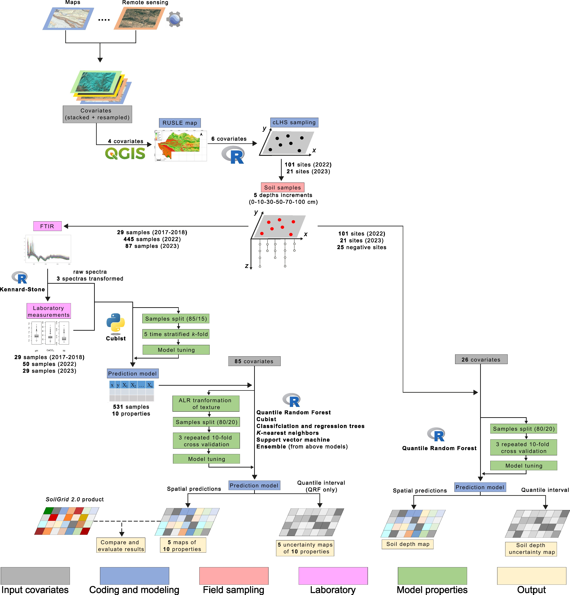

# DSM-Kurdistan

This is a complete description of the workflow related to the paper
*Soil information in Kurdistan region, Dohuk governorate (Iraq)*. It
contains all the pre-processing steps of the subsequent stages and the
data required to understand the entire process.

The code (R, Python and javascript) are followings the MIT licence while the rest of the data is following the CC BY-SA licence.

**Authors:**

-   Mathias Bellat, CRC1070 ResourceCultures, Department of Geosciences,
    Working group of Soil Science and Geomorphology, University of
    Tuebingen, Tuebingen, Germany, <mathias.bellat@uni-tuebingen.de>.

-   Nafiseh Kakhani, CRC1070 ResourceCultures, Department of
    Geosciences, Working group of Soil Science and Geomorphology,
    University of Tuebingen, Tuebingen, Germany,
    <nafiseh.kakhani@uni-tuebingen.de>.
