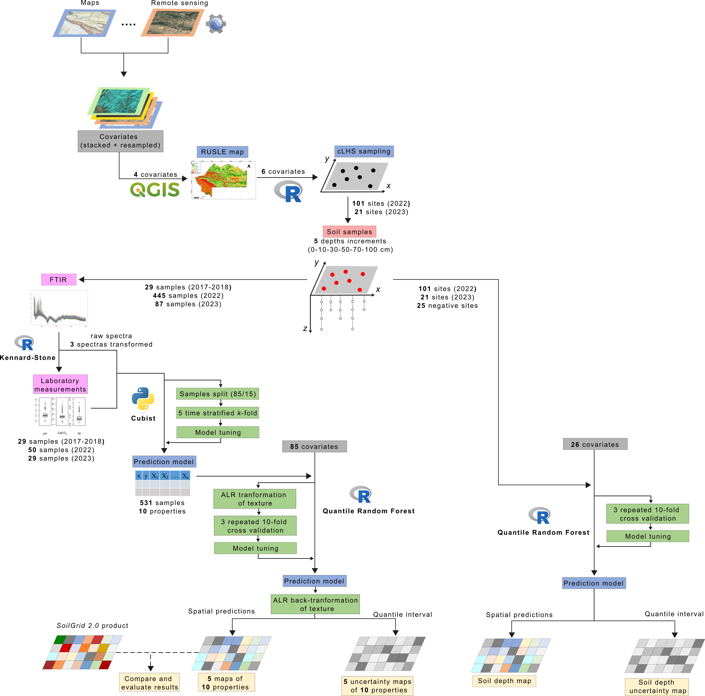

# Soil information in Kurdistan region, Dohuk governorate (Iraq), code and supplementary file

This deposit contains the code and the HTML supplementary file to Bellat, M.; Glissman, B.; Rensthscler, T.; Sconzo, P.; Kakhani, N.; Kohsravani, P.; Brifkany, B.; Pfälzner, P.
and Scholten, T., 2025. *Soil properties in northern Kurdistan region, Dohuk province (Iraq)*.

We present here the full workflow process of the paper within a [Bookdown file]((https://mathias-bellat.github.io/)/DSM-Kurdistan/)  

This is a complete description of the worflow related to the paper *Soil information in Kurdistan region, Dohuk governorate (Iraq)*. It contains in height different steps all the pre-process and necessary data to understand the whole process. This presentation of the material follows the **[FAIR](https://www.nature.com/articles/sdata201618) (Findable, Accessible, Interoperable, and Reuseable)** principles.

Additional visualisation of the 

**Related publications:** 

-  Bellat, M.; Glissman, B.; Rensthscler, T.; Sconzo, P.; Kakhani, N.; Kohsravani, P.; Brifkany, B.; Pfälzner, P.
  and Scholten, T., 2025. *Soil properties in northern Kurdistan region, Dohuk province (Iraq)*.

-Bellat, Mathias; Glissmann, Benjamin; Rentschler, Tobias; Sconzo, Paola; Pfälzner, Peter; Brifkany, Bekas; Scholten, Thomas (2024): "Digital soil mapping predicted on mid-infrared (MIR) spectroscopy measurements in North-Western Kurdistan region, Iraq (netCDF and GeoTIFF files) [dataset]". *PANGAEA*, [https://doi.org/10.1594/PANGAEA.973764](https://doi.org/10.1594/PANGAEA.973764)

Bellat, Mathias; Glissmann, Benjamin; Rentschler, Tobias; Sconzo, Paola; Pfälzner, Peter; Brifkany, Bekas; Scholten, Thomas (2024): "Soil bulk density and soil depth from on-site observations in the North-Western Kurdistan region, Iraq [dataset]". *PANGAEA*, [https://doi.org/10.1594/PANGAEA.973714](https://doi.org/10.1594/PANGAEA.973714)

Bellat, Mathias; Glissmann, Benjamin; Rentschler, Tobias; Sconzo, Paola; Pfälzner, Peter; Brifkany, Bekas; Scholten, Thomas (2024): "Soil properties in the North-Western Kurdistan region, Iraq, derived from laboratory measurements [dataset]". *PANGAEA*, [https://doi.org/10.1594/PANGAEA.973701](https://doi.org/10.1594/PANGAEA.973701)

Bellat, Mathias; Glissmann, Benjamin; Rentschler, Tobias; Sconzo, Paola; Pfälzner, Peter; Brifkany, Bekas; Scholten, Thomas (2024): "Soil properties predicted on mid-infrared (MIR) spectroscopy measurements in North-Western Kurdistan region, Iraq [dataset]". *PANGAEA*, [https://doi.org/10.1594/PANGAEA.973700](https://doi.org/10.1594/PANGAEA.973700)

**Authors:**

-   Mathias Bellat, CRC1070 ResourcesCultures,Department of Geosciences, Working group of Soil Science and Geomorphology, University of Tuebingen, Tuebingen, Germany, [mathias.bellat@uni-tuebingen.de](mailto:mathias.bellat@uni-tuebingen.de){.email}.

-   Nafiseh Kakhani, Department of Geosciences, Working group of Soil Science and Geomorphology, University of Tuebingen, Tuebingen, Germany, [nafiseh.kakhani@uni-tuebingen.de](mailto:nafiseh.kakhani@uni-tuebingen.de){.email}.
* make resources more 
